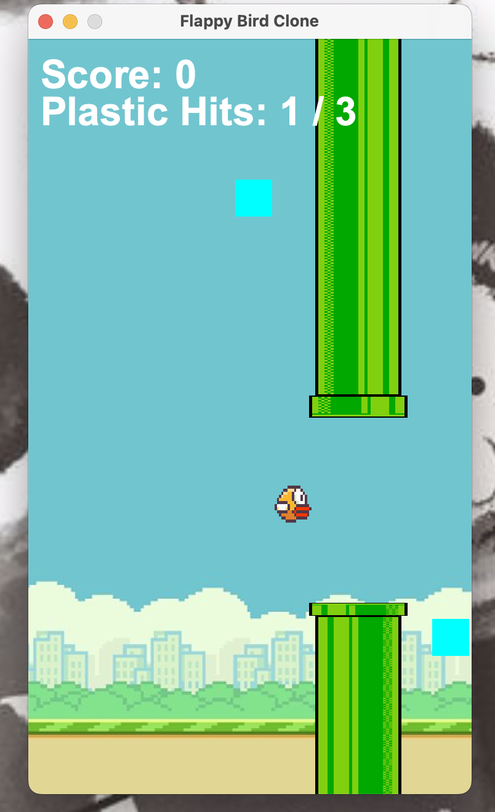

# 🐦 Flappy Bird Clone (Java)

<p align="center">
  
  
  
</p>

---

## 📌 Overview

A fully functional **Flappy Bird Clone** built using **Java Swing**, replicating the classic arcade gameplay with smooth physics and interactive UI.

This project demonstrates core concepts of:
- Event-driven programming
- Game loop logic
- Collision detection
- Basic physics simulation

---

## 🎮 Features

✨ Smooth bird movement with gravity  
✨ Infinite scrolling pipes  
✨ Real-time score tracking  
✨ Collision detection system  
✨ Restart game functionality  

---

## 🛠 Tech Stack

- **Language:** Java  
- **Framework:** Swing (GUI)  
- **Concepts:** OOP, Event Handling, Game Logic  

---

## 🚀 How to Run

```bash
# Clone the repository
git clone https://github.com/SamyuktaMenon/FlappyBird-Java.git

# Open in VS Code / IntelliJ

# Run the main file

## 📸 Preview


